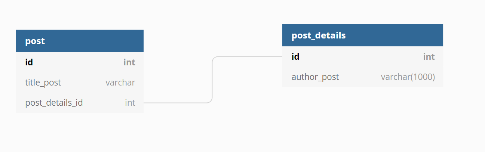
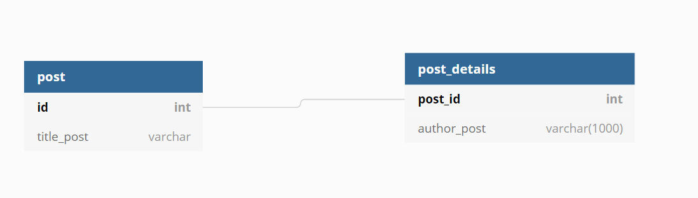
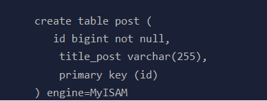
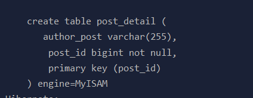
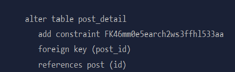

- [Additional](#additional)
  - [Các Annotaion Relation giữa các entity](#c%c3%a1c-annotaion-relation-gi%e1%bb%afa-c%c3%a1c-entity)
  - [One To One](#one-to-one)
    - [Using a Foreign Key In One Table](#using-a-foreign-key-in-one-table)
    - [Cách tốt nhất để thực hiện việc mapping OneToOne, share primary key](#c%c3%a1ch-t%e1%bb%91t-nh%e1%ba%a5t-%c4%91%e1%bb%83-th%e1%bb%b1c-hi%e1%bb%87n-vi%e1%bb%87c-mapping-onetoone-share-primary-key)
  - [Auto generate field từ Entity Vào DATABASE](#auto-generate-field-t%e1%bb%ab-entity-v%c3%a0o-database)
  - [Với việc cấu hình trong Database nhưng đặt tên thuộc tính trên Entity khác với database thì sẽ như thế nào?](#v%e1%bb%9bi-vi%e1%bb%87c-c%e1%ba%a5u-h%c3%acnh-trong-database-nh%c6%b0ng-%c4%91%e1%ba%b7t-t%c3%aan-thu%e1%bb%99c-t%c3%adnh-tr%c3%aan-entity-kh%c3%a1c-v%e1%bb%9bi-database-th%c3%ac-s%e1%ba%bd-nh%c6%b0-th%e1%ba%bf-n%c3%a0o)

# Additional

## Các Annotaion Relation giữa các entity

@JoinColumn để cấu hình nó là một khóa ngoại, liên kết đến primary key của bảng Address. Nếu để mặc định (chỉ áp dụng cho single join column) thì nó sẽ có thuộc tính như sau
- `name`: the name of entity + `_` + the name of the referenced primary key column.
- `referencedColumnName`: cùng tên với primary key column of the referenced table.

Với các Annotation thể hiện mối liên kết thì kiểu fetch có ý nghĩa mặc định như sau
- OneToMany: LAZY
- ManyToOne: EAGER
- ManyToMany: LAZY
- OneToOne: EAGER

## One To One

### Using a Foreign Key In One Table

Với database có quan hệ 1-1, sử dụng khóa chính của một bảng thành khóa ngoại của bảng kia. ví dụ như



Ở đây bảng Post giữ khóa ngoại là post_details_id. Với cấu hình database như trên ta làm như sau, và ngược lại, với cấu hình như trên thì dưới database sẽ như thế này.


Đầu tiên với Entity Post, ta cấu hình như sau, ta cần sử dụng @JoinColumn.

```java
@Entity
@Table(name="post")
public class Post {
    @Id
    @GeneratedValue
    private Long id;

    private String titlePost;

    @OneToOne(cascade = CascadeType.ALL)
    @JoinColumn
    private PostDetail postDetail;
}
```

với Entity PostDetails thì ta cấu hình như sau
```java
@Entity
public class PostDetails {
 
    @Id
    @GeneratedValue
    private long id;

    private String authorPost;

    @OneToOne(mappedBy ="post_details")
    private Post post;
 
    //Getters and setters omitted for brevity
}
```

### Cách tốt nhất để thực hiện việc mapping OneToOne, share primary key

Chúng ta thay vì tạo cột mới trên  column Post, ta có thể  đánh dấu cho primay key của PostDetail (post_details_id) vừa làm khóa chính vừa làm khóa ngoại  refference đến Entity Post.



Với cách thực hiện như vậy, do PK và FK thường được đánh dấu Index nên việc chia sẻ như vậy có thể giảm index mà ta cần đánh dấu đi một nữa mà tốc độ vẫn nhanh. 

để implement ý tưởng phía trên với hai Entity ta làm như sau

```java

@Entity
@Table(name="post")
public class Post {
    @Id
    @GeneratedValue
    private Long id;

    private String titlePost;

    @OneToOne(mappedBy = "post",cascade = CascadeType.ALL,fetch = FetchType.LAZY)
    private PostDetail postDetail;
}

//------------------------------------

@Entity
public class PostDetails {
 
    @Id
    private long id;

    private String authorPost;

    @OneToOne(fetch = FetchType.LAZY)
    @MapsId
    private Post post;
 
    //Getters and setters omitted for brevity
}
```

với annotaion @MapsId hibernate sẽ đánh dấu id column của address sẽ  vừa là khóa ngoại, vừa là khóa chính, lưu ý rằng với Th này thì @GeneratedValue không được sử dụng vì ta đang sử dụng PK của user làm Pk của address. Bên cạnh đó do FK bây giờ đang ở bên Entity Address nên mappedBy được sử dụng bên phía User.

Với việc cấu hình như trên, thì hibernate sẽ generate các table post, postDetail, và liên kết khóa ngoại giữa post và post detail:







ta có thể thấy rằng, post_detail sử dụng post_id vừa là khóa chính, vừa là khóa ngoại reference đến primary key của table post, giống như ta đã cấu hình.

## Auto generate field từ Entity Vào DATABASE

Mặc định khi ta làm việc với các property trên Entity, khi không cấu hình tên cho các thuộc tính bằng `@Column`  và tên các table thì nó sẽ tự động convert tên các thuộc tính và tên bảng  từ `Camel Case`  thành
`Snake Case`.

## Với việc cấu hình trong Database nhưng đặt tên thuộc tính trên Entity khác với database thì sẽ như thế nào?

Với các Entity quy định tên table không giống với database thì Entity sẽ tạo bảng mới, với những Entity Trùng khớp tên với database thì mapping giữa enitity trùng khớp với tên table không database.

Đối với các entity trùng khớp, những thuộc tính nào trong Entity không giống, thì hibernate sẽ tạo thêm các column mới trong bảng dưới database đó.

Và bên cạnh đó, hibernate sẽ update lại các primary key trên các entity đã mapping trùng khớp với table trong database. Nhưng dễ gây ra lỗi vì mapping không đồng nhất giữa các Entity với table trong database về các khóa chính và khóa ngoại.


