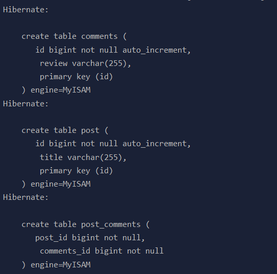

- [Additional](#additional)
  - [Các Annotaion Relation giữa các entity](#c%c3%a1c-annotaion-relation-gi%e1%bb%afa-c%c3%a1c-entity)
  - [One To One](#one-to-one)
    - [Using a Foreign Key In One Table](#using-a-foreign-key-in-one-table)
    - [Cách tốt nhất để thực hiện việc mapping OneToOne, share primary key](#c%c3%a1ch-t%e1%bb%91t-nh%e1%ba%a5t-%c4%91%e1%bb%83-th%e1%bb%b1c-hi%e1%bb%87n-vi%e1%bb%87c-mapping-onetoone-share-primary-key)
  - [One to Many](#one-to-many)
    - [Unidirectional @OneToMany](#unidirectional-onetomany)
    - [Unidirectional @OneToMany with @JoinColumn](#unidirectional-onetomany-with-joincolumn)
    - [Bidirectional @OneToMany (The best way)](#bidirectional-onetomany-the-best-way)
  - [Auto generate field từ Entity Vào DATABASE](#auto-generate-field-t%e1%bb%ab-entity-v%c3%a0o-database)
  - [Với việc cấu hình trong Database nhưng đặt tên thuộc tính trên Entity khác với database thì sẽ như thế nào?](#v%e1%bb%9bi-vi%e1%bb%87c-c%e1%ba%a5u-h%c3%acnh-trong-database-nh%c6%b0ng-%c4%91%e1%ba%b7t-t%c3%aan-thu%e1%bb%99c-t%c3%adnh-tr%c3%aan-entity-kh%c3%a1c-v%e1%bb%9bi-database-th%c3%ac-s%e1%ba%bd-nh%c6%b0-th%e1%ba%bf-n%c3%a0o)
  - [Tài liệu tham khảo](#t%c3%a0i-li%e1%bb%87u-tham-kh%e1%ba%a3o)

# Additional

## Các Annotaion Relation giữa các entity

@JoinColumn để cấu hình nó là một khóa ngoại, liên kết đến primary key của các Entity Có cấu hình quan hệ OneToMany với nó, ở đây là Entity Address. Nếu để mặc định (chỉ áp dụng cho single join column) thì nó sẽ có thuộc tính như sau
- `name`: the name of entity + `_` + the name of the referenced primary key column.
- `referencedColumnName`: cùng tên với primary key column of the referenced table.

Với các Annotation thể hiện mối liên kết thì kiểu fetch có ý nghĩa mặc định như sau
- OneToMany: LAZY
- ManyToOne: EAGER
- ManyToMany: LAZY
- OneToOne: EAGER

## One To One

### Using a Foreign Key In One Table

Với database có quan hệ 1-1, sử dụng khóa chính của một bảng thành khóa ngoại của bảng kia. ví dụ như


Ở đây bảng Post giữ khóa ngoại là post_details_id. Với cấu hình database như trên ta làm như sau, và ngược lại, với cấu hình như trên thì dưới database sẽ như thế này.


Đầu tiên với Entity Post, ta cấu hình như sau, ta cần sử dụng @JoinColumn.

```java
@Entity
@Table(name="post")
public class Post {
    @Id
    @GeneratedValue
    private Long id;

    private String titlePost;

    @OneToOne(cascade = CascadeType.ALL)
    @JoinColumn
    private PostDetail postDetail;
}
```

với Entity PostDetails thì ta cấu hình như sau
```java
@Entity
public class PostDetails {
 
    @Id
    @GeneratedValue
    private long id;

    private String authorPost;

    @OneToOne(mappedBy ="post_details")
    private Post post;
 
    //Getters and setters omitted for brevity
}
```

### Cách tốt nhất để thực hiện việc mapping OneToOne, share primary key

Chúng ta thay vì tạo cột mới trên  column Post, ta có thể  đánh dấu cho primay key của PostDetail (post_details_id) vừa làm khóa chính vừa làm khóa ngoại  refference đến Entity Post.


Với cách thực hiện như vậy, do PK và FK thường được đánh dấu Index nên việc chia sẻ như vậy có thể giảm index mà ta cần đánh dấu đi một nữa mà tốc độ vẫn nhanh. 

để implement ý tưởng phía trên với hai Entity ta làm như sau

```java

@Entity
@Table(name="post")
public class Post {
    @Id
    @GeneratedValue
    private Long id;

    private String titlePost;

    @OneToOne(mappedBy = "post",cascade = CascadeType.ALL,fetch = FetchType.LAZY)
    private PostDetail postDetail;
}

//------------------------------------

@Entity
public class PostDetails {
 
    @Id
    private long id;

    private String authorPost;

    @OneToOne(fetch = FetchType.LAZY)
    @MapsId
    private Post post;
 
    //Getters and setters omitted for brevity
}
```

với annotaion @MapsId hibernate sẽ đánh dấu id column của address sẽ  vừa là khóa ngoại, vừa là khóa chính, lưu ý rằng với Th này thì @GeneratedValue không được sử dụng vì ta đang sử dụng PK của user làm Pk của address. Bên cạnh đó do FK bây giờ đang ở bên Entity Address nên mappedBy được sử dụng bên phía User.

Với việc cấu hình như trên, thì hibernate sẽ generate các table post, postDetail, và liên kết khóa ngoại giữa post và post detail:


ta có thể thấy rằng, post_detail sử dụng post_id vừa là khóa chính, vừa là khóa ngoại reference đến primary key của table post, giống như ta đã cấu hình.


## One to Many

### Unidirectional @OneToMany

Với mối quan hệ OneToMany mà khi ta chỉ cấu hình mối quan hệ ở Entity Parent, còn được gọi là `Unidirectional @OneToMany`, cụ thể như sau

```java
@Entity
@Table(name = "post")
public class Post {

    @Id
    @GeneratedValue(strategy = GenerationType.IDENTITY)
    private Long id;

    private String title;

    //when child entity is removed from collection of parent, they will be deleted in DB
    @OneToMany(
            cascade = CascadeType.ALL,
            fetch = FetchType.LAZY)
    private List<PostComment> comments = new ArrayList<>();
}

//---------------------------------------------

@Entity
@Table(name = "comments")

public class PostComment {

    @Id
    @GeneratedValue(strategy = GenerationType.IDENTITY)
    private Long id;

    private String review;
}
```

với cách cấu hình một chiều từ parent sang child entity phía trên hibernate sẽ tạo trong database như sau



Tương đương dưới database sẽ thể hiện như thế này


Nhìn mối quan hệ ta có thể thấy, dưới database chúng sẽ tạo ra thêm một bảng thứ ba, giống như mối quan hệ many-to-many, ta phải tốn thêm tài nguyên để lưu trữ, và việc đánh index two foregin key tốn thêm bộ nhớ cho việc đánh index này.

### Unidirectional @OneToMany with @JoinColumn

Tương tự như việc cấu hình như ví dụ trên, nhưng lần này ta thêm vào một annotation là `@JoinColumn` ở Entity Post như sau 

```java
@OneToMany(cascade = CascadeType.ALL, orphanRemoval = true)
@JoinColumn(name = "post_id")
private List<PostComment> comments = new ArrayList<>();
```

@JoinColumn thể hiện đây là khóa ngoại của bảng, và nó refference đến liên kết đã được định nghĩa với nó ở Entity khác bằng `@OneToMany`.

Với cách định nghĩa như trên, thì dưới database, lần này sẽ chỉ tạo ra hai bảng, nhưng có vấn đề như sau, nó sẽ thực hiện thêm vài câu SQL hơn bình thường, cụ thể như sau

```sql
insert into post (title, id)
values ('First post', 1)
 
insert into post_comment (review, id)
values ('My first review', 2)
 
insert into post_comment (review, id)
values ('My second review', 3)
 
insert into post_comment (review, id)
values ('My third review', 4)
 
update post_comment set post_id = 1 where id = 2
 
update post_comment set post_id = 1 where id =  3
 
update post_comment set post_id = 1 where id =  4
```

Với việc cấu hình như vậy, khi insert hoặc delete thì nó sẽ thực hiện thêm một số câu lệnh sql, đầu tiên khi insert, nó sẽ chỉ insert các child Entity vào database, sau đó ở chúng mới được update thêm khóa ngoại, chứ không thực hiện liền ngay từ ban đầu, làm phát sinh thêm các câu SQL, kể cả việc xóa cũng như vậy.

### Bidirectional @OneToMany (The best way)

Với các cách liên kết phía trên, ta có thể thấy luôn có sự dư thừa ở các câu sql khi thực hiện các thao tác thêm, xóa dưới database. Để khắc phục thì ta có thể sử dụng thêm @ManyToOne ở Entity child.

```java
@Entity
@Table(name="post")
public class Post {

    @Id
    @GeneratedValue
    private Long id;

    private String titlePost;

    //when child entity is removed from collection of parent, they will be deleted in DB
    @OneToMany(
            mappedBy = "post",
            cascade = CascadeType.ALL,
            fetch = FetchType.LAZY)
    private List<PostComment> comments = new ArrayList<>();
}
//-----------------------------------

@Entity
public class PostComment {

    @Id
    @GeneratedValue(strategy = GenerationType.IDENTITY)
    private Long id;

    private String review;

    @ManyToOne(fetch = FetchType.LAZY)
    @JoinColumn
    private Post post;
}
```

Với cách thực hiện phía trên thì sự dư thừa ở các câu SQL sẽ được loại bỏ hoàn toàn, các khóa ngoại sẽ được thêm ngay từ ban đầu ở các câu lệnh insert của Table comments. Thêm nữa ở đây ta có thể truy cập parent Entity từ child Entity để lấy thông tin của parent.

## Auto generate field từ Entity Vào DATABASE

Mặc định khi ta làm việc với các property trên Entity, khi không cấu hình tên cho các thuộc tính bằng `@Column`  và tên các table thì nó sẽ tự động convert tên các thuộc tính và tên bảng  từ `Camel Case`  thành
`Snake Case`.

## Với việc cấu hình trong Database nhưng đặt tên thuộc tính trên Entity khác với database thì sẽ như thế nào?

Với các Entity quy định tên table không giống với database thì Entity sẽ tạo bảng mới, với những Entity Trùng khớp tên với database thì mapping giữa enitity trùng khớp với tên table không database.

Đối với các entity trùng khớp, những thuộc tính nào trong Entity không giống, thì hibernate sẽ tạo thêm các column mới trong bảng dưới database đó.

Và bên cạnh đó, hibernate sẽ update lại các primary key trên các entity đã mapping trùng khớp với table trong database. Nhưng dễ gây ra lỗi vì mapping không đồng nhất giữa các Entity với table trong database về các khóa chính và khóa ngoại.

## Tài liệu tham khảo

https://www.baeldung.com/jpa-one-to-one

https://vladmihalcea.com/the-best-way-to-map-a-onetomany-association-with-jpa-and-hibernate/

https://vladmihalcea.com/the-best-way-to-map-a-onetoone-relationship-with-jpa-and-hibernate/

