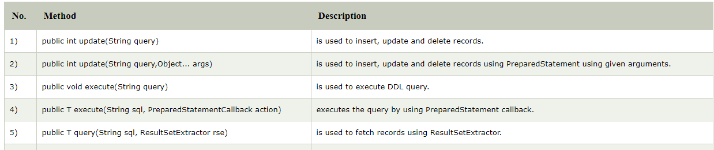

# Spring JDBC

## Overview

Spring JDBC được chia làm 4 package chính
- Core: chứa các chức năng chính của JDBC. Trong package này chứa một số class quan trọng như JdbcTemplate, SimpleJdbcInsert, SimpleJdbcCall and NamedParameterJdbcTemplate.
- Datasource: class được dùng để truy cập vào datasource.
- Object: sau khi truy cập vào DB thực thi các câu truy vấn thì nó sẽ trả về dữ liệu dưới dạng các object.
- support: support class hỗ trợ cho các class trong các packet core và object.

## Configure


## The JdbcTemplate and running queries

### Problem with JDBC Api

We need to write a lot of code before and after executing the query, such as creating connection, statement, closing resultset, connection etc.
We need to perform exception handling code on the database logic.
We need to handle transaction.
Repetition of all these codes from one to another database logic is a time consuming task.

### Advantage of Spring JdbcTemplate

Spring JdbcTemplate eliminates all the above mentioned problems of JDBC API. It provides you methods to write the queries directly, so it saves a lot of work and time.

nó bao gồm các logic phổ biến nhất trong việc sử dụng JDBC API để truy cập vào cơ sở dữ liệu, chẳng hạn như tạo kết nối, tạo các lệnh truy vấn, xóa, sửa, cập nhập dữ liệu... Lớp này có thể tìm thấy trong gói (package) org.springframework.jdbc.core.


### Spring JDBC Approaches

Spring framework provides following approaches for JDBC database access:

- JdbcTemplate
- NamedParameterJdbcTemplate
- SimpleJdbcTemplate
- SimpleJdbcInsert and SimpleJdbcCall

## How JdbcTemplate can link to its DataSource?

The DriverManagerDataSource is used to contain the information about the database such as driver class name, connnection URL, username and password.

## How to do query/update with JdbcTemplate?

```java
@Configuration
@ComponentScan("com.baeldung.jdbc")
public class SpringJdbcConfig {
    @Bean
    public DataSource mysqlDataSource() {
        DriverManagerDataSource dataSource = new DriverManagerDataSource();
        dataSource.setDriverClassName("com.mysql.jdbc.Driver");
        dataSource.setUrl("jdbc:mysql://localhost:3306/springjdbc");
        dataSource.setUsername("guest_user");
        dataSource.setPassword("guest_password");
 
        return dataSource;
    }
}

JdbcTemplate template = new JdbcTemplate();
template.setDataSource(dataSource);

```
## How to do query/update with JdbcTemplate?

Nó đảm nhận vai trò đóng mở kết nối với Db nên ta không cần quan tâm đến việc đó. Nó cũng cung cấp việc quản lí exception và cung cấp thông tin về exception messages by the help of excepion classes defined in the org.springframework.dao package.



ví dụ về query
```java
int result = jdbcTemplate.queryForObject(
    "SELECT COUNT(*) FROM EMPLOYEE", Integer.class);
```

update
```java 
return jdbcTemplate.update(
        "INSERT INTO EMPLOYEE VALUES (?, ?, ?, ?)", 5, "Bill", "Gates", "USA");
```

hoặc có thể sử dụng preStatement in JDBC template
```java
   String query="insert into employee values(?,?,?)";  
    return jdbcTemplate.execute(query,new PreparedStatementCallback<Boolean>(){  
    @Override  
    public Boolean doInPreparedStatement(PreparedStatement ps)  
            throws SQLException, DataAccessException {  
              
        ps.setInt(1,e.getId());  
        ps.setString(2,e.getName());  
        ps.setFloat(3,e.getSalary());  
              
        return ps.execute();  
    }  
    });  
```
## How to map query result to java object?

Ta có thể sử đụng ResultSetExtractor hoặc RowMapper

### ResultSetExtractor

We can easily fetch the records from the database using query() method of JdbcTemplate class where we need to pass the instance of ResultSetExtractor.

`public T query(String sql,ResultSetExtractor<T> rse)`

```java
public List<Employee> getAllEmployees(){  
 return template.query("select * from employee",new ResultSetExtractor<List<Employee>>(){  
    @Override  
     public List<Employee> extractData(ResultSet rs) throws SQLException,  
            DataAccessException {  
      
        List<Employee> list=new ArrayList<Employee>();  
        while(rs.next()){  
        Employee e=new Employee();  
        e.setId(rs.getInt(1));  
        e.setName(rs.getString(2));  
        e.setSalary(rs.getInt(3));  
        list.add(e);  
        }  
        return list;  
        }  
    });  
  }  
} 

```

### RowMapper 

```java
public List<Employee> getAllEmployeesRowMapper(){  
 return template.query("select * from employee",new RowMapper<Employee>(){  
    @Override  
    public Employee mapRow(ResultSet rs, int rownumber) throws SQLException {  
        Employee e=new Employee();  
        e.setId(rs.getInt(1));  
        e.setName(rs.getString(2));  
        e.setSalary(rs.getInt(3));  
        return e;  
    }  
    });  
}  
}  
```

## How Spring Boot help in configuration and usage of JDBC?

### Maven dependency

```xml
<dependency>
    <groupId>org.springframework.boot</groupId>
    <artifactId>spring-boot-starter-jdbc</artifactId>
</dependency>
<dependency>
    <groupId>mysql</groupId>
    <artifactId>mysql-connector-java</artifactId>
    <scope>runtime</scope>
</dependency>
```
### Config in properties file

```properties
spring.datasource.url=jdbc:mysql://localhost:3306/springjdbc
spring.datasource.username=guest_user
spring.datasource.password=guest_password
```
